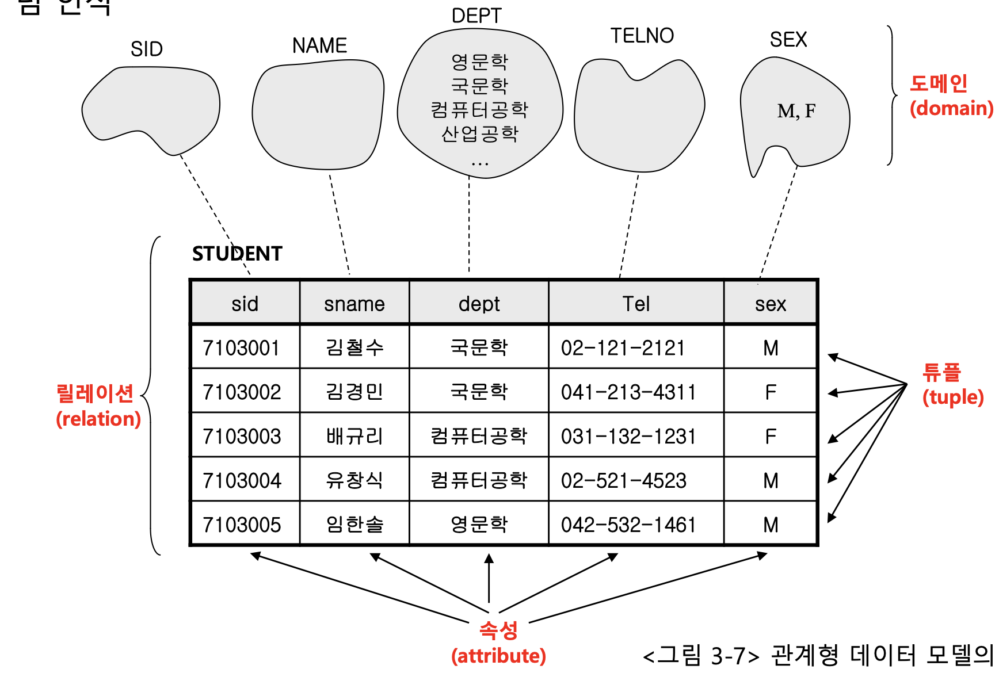
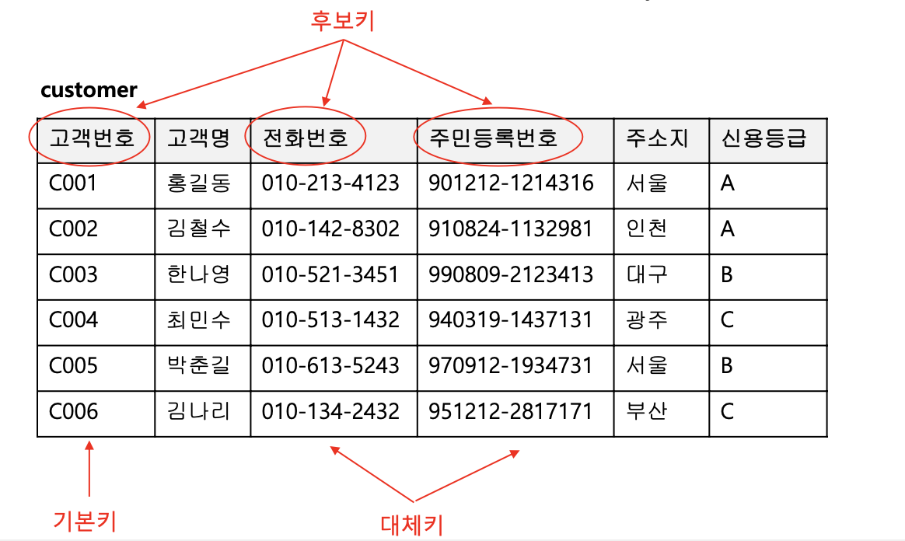
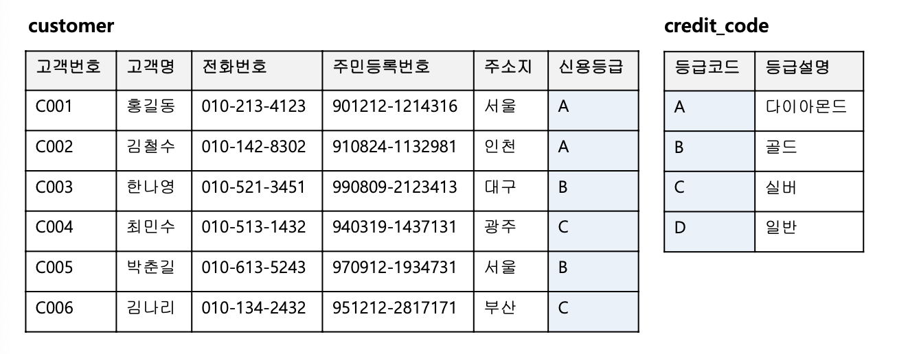
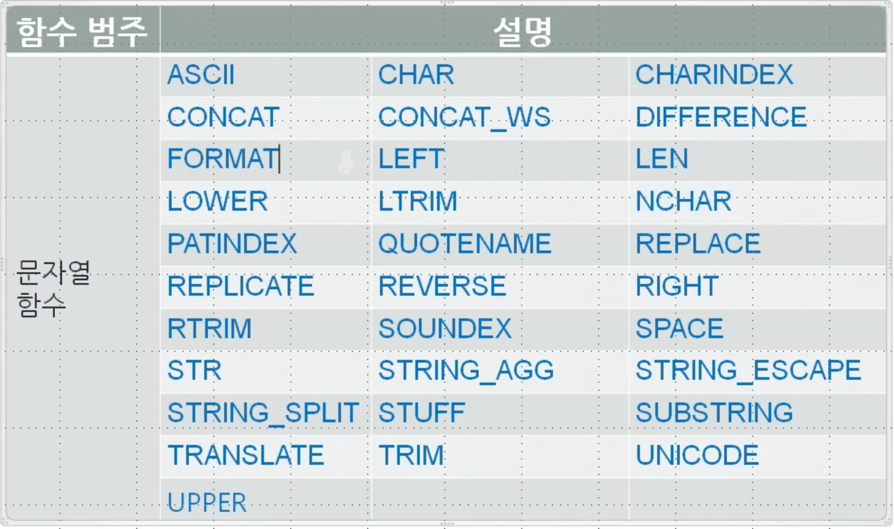

# Database

### Database

- 여러 사람이 공유하여 사용할 목적으로 관리하는 데이터의 집합이다.
  - 즉 데이터를 좀 더 용이하게 저장하고 사용하기위한 저장소라 생각하면 편할 것 같다.


### DBMS (데이터베이스 매니지먼트 시스템)

- 데이터베이스를 이용하는 데이터를 저장하고 처리하는 시스템
- 대표적이 DBMS 
  - Oracle 
    - 전세계에서 가장 많이 사용되는 DBMS (32%)
    - 국내 기준으로 60%에 육박하다.
  - Mysql
  - MariaDB
  - MSSQL
- 데이터베이스에 정보를 저장하는 기본단위는 **Table(테이블)**
  - 데이터베이스는 테이블들의 집합
    - 데이터를 연관지을 때 foriegn key(외래 키)와 같은 정보로 매핑을 진행한다.
  - **데이터 베이스는 설계가 매우 중요하다.**


### DBMS가 제공하는 시스템

- 데이터 정의 기능
  - 사용자로 하여금 데이터베이스 생성 및 파일(테이블) 생성을 할 수 있도록 지원
- 데이터 조작 기능
  - 데이터 조회, 삽입, 수정, 변경, 삭제 기능을 제공한다.
- 데이터 제어 기능
  - 데이터를 정확하고 안전하게 유지하는 기능을 말한다.
  - 다수 사용자의 요구를 동시에 처리하는 기능, 정기적으로 데이터베이스를 백업하고 데이터베이스에 장애가 발생하면 이를 복구하는 기능을 제공한다.


### DBA

- 데이터베이스 시스템의 운영, 관리에 대한 책임을 지고 있는 사용자
- 데이터베이스에 저장된 정보를 이용하기보다는 데이터베이스를 설계하고 구축하며, DBMS가 정상적인 성능을 유지할 수 있도록 관리하는 데 관심
- 전문적인 관리 도구를 이용하여 임무를 수행


### 데이터베이스의 구현

- 보통 물리적인 저장장치인 하드 디스크 상에 구현
- 물리적 구현방식은 DBMS마다 다르다.


### 데이터 구조

- 관계형 모델에서는 데이터가 마치 테이블 형태로 존재하는 것처럼 인식한다.

  - Relation: 테이블
  - 튜플: 한 행 데이터 한줄
  - 속성: 데이터의 속성
  - 도메인: 무결성을 위한 장치(데이터의 형식에 대한 규칙)

  

**릴레이션(relation)**

- 데이터의 기본 관리 단위 (오늘날 테이블이라고 함)
- 데이터베이스는 이러한 릴레이션들의 집합

**속성(attribute)**

- 릴레이션의 열을 가리키는 용어
- 릴레이션에 저장되는 정보 항목의 이름
  - ex) name, age, 등
- 작명은 임의로 가능, 동일한 릴레이션 내에 중복된 속성이 존재하면 안된다.
- 릴레이션의 **차수(degree)**: 릴레이션에 포함된 속성의 개수

**튜플**

- 릴레이션에서 하나의 행을 가리키는 용어

- 하나의 튜플은 한명의 학생에 대한 정보를 표현

- 릴레이션의 **카디널리티(cardinality)**: 릴레이션에 포함된 튜플의 수


**도메인**

- 릴레이션에서 각 속성에 저장될 수 있는 후보값들의 집합
- 모든 속성은 자신이 속할 도메인과 연결
- 올바르지 않는 데이터가 입력되는 것을 방지할 목적
  - 성별속성에 M(남자), F(여자)가 아닌 값이 입력된다면 오류라고 판단 가능
- 데이터 타입을 지정하는것으로 도메인의 취지를 계승


### 스키마(schema)와 인스턴스(instance)

- **스키마**는 '구조'의 의미를 갖는 용어
  - like 청사진
- 데이터베이스 스키마, 릴레이션 스키마와 같이 다른 용어에 붙여서 사용한다.
- **데이터베이스 스키마**: 데이터베이스의 구조를 말함. 데이터베이스 안에 어떤 릴레이션이 있는가, 릴레이션에 어떤 속성들이 있는가, 릴레이션간의 어떤 관계가 있는가
- 데이터베이스에 어떤 데이터를 저장하기 위해서는 먼저 데이터베이스 스키마가 정해져야 한다.

- **데이터베이스 인스턴스**: 특정 시점에서 보았을 때 데이터베이스 안에 저장된 데이터의 집합
- 데이터베이스 스키마는 구조이기 때문에 잘 변하지 않으나, 인스턴스는 데이터의 입력, 수정, 삭제가 일어날 때 마다 변화된다.


// 자바의 class와 instance로 생각하면도 편할 듯


### 데이터 무결성 규칙

- 데이터베이스가 지향하는 철학 중 하나는 '데이터베이스에 저장되는 데이터는 오류가 없어야 한다'
- **데이터 무결성(data integrity)**: 저장되는 데이터가 정확하고 유효한 상태로 유지되는 성질
- DBMS가 데이터 무결성을 보장할 수 있어야 한다.

- 모든 경우에 대해서 DBMS로 하여금 무결성을 유지하도록 하는 것은 현실적으로 불가능에 가깝다.


**DBMS가 지켜야할 최소한의 규칙**

- **개체 무결성 규칙 (entity integirty rule)**
- **참조 무결성 규칙 (referential integrity rule)**


**개체 무결성 규칙**

- 릴레이션에 저장되는 튜플들은 그 튜플을 다른 튜플과 구분하는데 사용하는 속성을 가지고 있다.

  - **기본 키(primary key)**
  - 학생 릴레이션의 학번

- 개체 무결성 규칙

  ~~~
  "릴레이션의 기본키 속성에는 Null이 입력될 수 없다."
  ~~~

- 릴레이션에서 기본키 속성에 값을 부여하여 개체(튜플)와 개체(튜플)를 구분할 수 있어야 한다는 의미에서 개체 무결성 규칙이라고 함


**참조 무결성 규칙**

- DBMS에게 참조 관계를 알려주면 참조 무결성을 지킬 수 있다.

  - 외래키를 이용하면 참조관계를 알려줄 수 있다.

- 참조 무결성 규칙

  ~~~
  참조 관계에 있는 두 릴레이션의 데이터 사이에는 일관성이 있어야 한다.
  ~~~

  


### 기본키와 외래키

#### 기본키

- 개체 무결성 규칙: 테이블에 저장되는 튜플들은 중복된 것이 존재하면 안된다는 규칙

- 기본키는 **개체 무결성 규칙**을 구현하는 수단

- 기본키 컬럼에는 NULL이 저장될 수 없다.

- 개체 무결성 규칙을 지키기 위해서는 새로운 튜플이 입력될 때 마다 모든 튜플들과 비교하여 중복 여부를 확인하여야 하는데 이는 현실적으로 어렵다.

- 현실에서는 **기본키 컬럼의 값만 비교하여** 중복성 여부를 판단

- 기본키의 일반화된 명칭은 **후보키(candidate key)**

  - 후보 키는 튜플의 고유성을 식별하는 기준이 될 수 있는 모든 컬럼(들)을 의미
  - 후보키 중에서 실제로 튜플의 중복성 판단에 사용되는 컬럼이 **기본키**
  - 기본키가 아닌 나머지 후보키들이 **대체키(alternate key)**

  

  - 후보키와 기본키 선정은 데이터베이스 설계의 문제

  - 기본키는 보통 하나의 컬럼인 경우가 많지만, 여러 개의 컬럼이 모여야 기본키 역할을 할 수 있는 경우도 있음


#### 외래키

- 참조 무결성 규칙: 서로 연관된 두 테이블은 저장된 데이터들 사이에 일관성을 유지해야 한다는 규칙

- 외래키는 **참조 무결성 규칙을** 구현하는 수단

- 두 테이블이 공통속성을 갖을 때 **두 테이블이 서로 연관되어 있다**라고 말한다.




# SQL

Structed Query Language

- 관계형 데이터베이스 관리 시스템(RDBMS)의 데이터를 관리하기 위해 설계된 특수 목적의 프로그래밍 언어
- 관계형 데이터베이스 관리 시스템에서 자료의 검색과 관리, 데이터베이스 스키마 생성과 수정, 데이터베이스 객체 접근 조정 관리를 위해 고안


### SQL문장 종류

| 명령어 분류                                              | 명령어    | 설명                                                         |
| :------------------------------------------------------- | --------- | ------------------------------------------------------------ |
| DQL<br>Data Query Language<br>(질의어)                   | SELECT    | 데이터 검색 시 사용한다                                      |
| DML<br/>Data Manipulation Language<br/>(질의어)          | INSERT    | 데이터 입력 시 사용한다.                                     |
| //                                                       | UPDATE    | 데이터 수정 시 사용한다.                                     |
| //                                                       | DELETE    | 데이터 삭제 시 사용한다.                                     |
| DDL<br>Data Definition Language<br>(데이터 정의어)       | CREATE    | 데이터베이스 객체를 생성한다.                                |
| //                                                       | ALTER     | 데이터베이스 객체를 변경한다.                                |
| //                                                       | DROP      | 데이터베이스 객체를 삭제한다.                                |
| //                                                       | RENAME    | 데이터베이스 객체 이름을 변경한다.                           |
| TCL<br>Transaction Control Language<br>(트랜잭션 처리어) | TRUNCATE  | 데이터베이스 객체의 저장 공간을 삭제한다.                    |
| //                                                       | COMMIT    | 트랜잭션의 정상적인 종료를 처리한다.                         |
| //                                                       | ROLLBACK  | 트랜잭션을 취소한다. 트랜잭션을 실행되기 전 상태로 돌아간다. |
| DCL<br>Data Control Language<br>(데이터 제어어)          | SAVEPOINT | 트랜잭션 내 임시 저장점을 설정한다.                          |
| //                                                       | GRANT     | 데이터베이스에 대한 일련의 권한을 부여한다.                  |
| //                                                       | REVOKE    | 데이터베이스에 대한 일련의 권한을 취소한다.                  |


### SELECT 절

- SELECT 문에서 필수 구성 절. SELECT 다음에는 연산식이 온다.
- 열 이름에 사용할 수 있는 문자는 영문자, 숫자 및 $, #, _을 사용할 수 있다.
- 열 이름의 첫 글자는 영문 알파벳만 가능하다.
- 문자 상한의 최대 30자까지 가능하다.
- 기본값은 대문자로 표시된다. 문자 등으로 표시하려면 단일 행 함수를 사용하거나, `''` 로 둘러 싸는 등의 처리가 필요하다.
- 각종 DBMS의 예약어는 사용할 수 없는 경우가 있다.


#### ALL / DISTINCT

ALL - 테이블에 동일한 데이터 행이 있는 경우에도 모든 데이터를 반환한다. 지정하지 않으면 ALL이 선택된다.

DISTINCT (UNIQUE) - 테이블에 동일한 데이터 행이 있는 경우 중복을 제거한 1개만을 반환한다.


#### 컬럼 별칭

컬럼명 [AS] 컬럼 별칭 (AS는 생략가능)으로 컬럼을 다른이름으로 표시할 수 있다.

단, WHERE 절, GROUP BY 절, HAVING 절은 컬럼 별칭은 없다.


- SELECT 다음에는 계산식이 올 수 있음
- 여러 테이블에서 지정하면 결합이 이루어진 JOIN을 이용하는 것 외에 WHERE 절은 공통 열 결합 관계를 지정하는 것도 가능하다. (단, 이 경우 OUTER JOIN은 불가능하다)
- 이 FROM 절에서 테이블 별칭 지정이 가능하지만 일단 테이블 별칭을 지정하면 테이블 별명으로 묘사 해주지 않으면 에러가 발생한다.


#### SELECT 문법

~~~SQL
SELECT [ALL | DISTINCT] 컬럼명 [, 컬럼명...]
[INTO 테이블명]
FROM 테이블명 [, 테이블명...]
[WHERE 조건식]
[GROUP BY 컬럼명 [HAVING 조건식]]
[ORDER BY 컬럼명]
~~~


##### Case 문

~~~sql
select (
  case 기준 col
    when 값 then '결과1'
    when 값 then '결과2'
    else '결과3'
  end
	) as '출력 컬럼',
  col1,
  col2
from 테이블
where 조건
~~~


### Join


#### 조인이란

- 한 데이터베이스 내의 여러 테이블의 레코드를 조합하여 하나의 열로 표현한 것이다.
- 따라서 조인은 테이블로서 저장되거나, 그자체로 이용할수 있는 결과를 만들어낸다.


#### 조인의 필요성

- RDB(관계형 데이터베이스)의 구조적 특징으로 정규화를 수행하면 의미 있는 데이터 집합으로 테이블이 구성되고 각 테이블끼리는 관계를 갖는다.
- 이와 같은 특징으로 관계형 데이터베이스는 저장 공간의 효율성과 확장성이 향상되게 된다.
- 다른 한편으로는 **서로 관계있는 데이터가 여러 테이블로 나뉘어 저장되므로 각 테이블에 저장된 데이터를 효과적으로 검색하기 위해 조인이 필요하다**


#### 1. 내부조인(INNER JOIN)

- 여러 애플리케이션에서 사용되는 가장 흔한 결합 방식이며 기본 조인 형식으로 간주된다.
- 내부 조인은 조인 구문에 기반한 2개의 테이블(A, B)의 컬럼 값을 결합함으로써 새로운 결과 테이블을 생성한다.
- 명시적 조인 표현(explicit)과 암시적 조인 표현(implicit) 2개의 다른 조인식 구문이 있다.
- **교집합**이라 생각하면 편하다.
- 보통 내부 조인을 하는 컬럼에 index를 거는 경우가 많다.
  - 조회는 속도가 중요하기에 index를 설정한다.

~~~~sql
select *
from student
         (inner) join dept d on student.dept_id = d.dept_id
order by student_id desc;

select *
from student s, dept d
where s.dept_id = d.dept_id;
~~~~


#### 2.교차 조인(CROSS JOIN)

- 조인되는 두 테이블에서 곱집합을 반환한다.
- 즉, 두 번째 테이블로부터 각 행과 첫 번째 테이블에서 각 행이 한번씩 결합된 열을 만들 것이다.
- 예를 들어 m행을 가진 테이블과 n행을 가진 테이블이 교차 조인되면 m*n 개의 행을 생성한다.

~~~sql
select *
from student
         cross join dept d;
         
select *
from student s, dept d;
~~~


#### 3. 외부 조인(OUTER JOIN)

- 조인 대상 테이블에서 특정 테이블의 데이터가 모두 필요한 상황에서 외부 조인을 활용하여 효과적으로 결과 집합을 생성할 수 있다.
- 실무에서는 성능 문제로 인해 사용을 지양하는 편이다.
  - 근데 어쩔 수 없이 쓰는 경우가 많다.


#### **3.1 왼쪽 외부 조인(left outer join)**

- 우츨 테이블에 조인할 컬럼의 값이 없는 경우 사용한다.
- 즉, 좌측 테이블의 모든 데이터를 포함하는 결과 집합을 생성한다.

~~~sql
select *
from student
         left join dept d on student.dept_id = d.dept_id;
~~~


#### 3.2 오른쪽 외부 조인(right outer join)

- 좌측 테이블에 조인할 컬럼의 값이 없는 경우 사용한다.
- 즉, 우측 테이블의 모든 데이터를 포함하는 결과 집합을 생성한다.

~~~
select *
from student s
         right join dept d on student.dept_id = d.dept_id;
~~~


### 완전 외부 조인(FULL OUTER JOIN)

- 양쪽 테이블 모두 OUTER JOIN이 필요할 때 사용한다.
- Mysql 에서는 full outer join을 지원하지 않는다.
  - oracle은 지원한다.

~~~
select *
from student s
         left join dept d on s.dept_id = d.dept_id
union
select *
from student s
         right join dept d on s.dept_id = d.dept_id;
~~~


#### Select into 문법

- 테이블을 복사하는 문법이다.

다른 DB에서는 Select into를 사용하나, MySQL은 지원하지 않는다.


**다른 DB의 Select into 문법**

~~~sql
select *
into 복사하고 싶은 테이블
from 원본 테이블
where 조건식
~~~


**MySQL의 Select into 문법**

~~~sql
create table 복사 테이블 as(
	select * 
	from 원본 테이블
	where 조건식
)
~~~


#### **union**

- 컬럼의 데이터 형식이 똑같으면 여러개의 select 절을 union 으로 묶을 수 있다

- 합집합으로 생각하면 편할것 같다.

ex)

```sql
select '남성 고객', count(*)
from Customer
where customer_sex = 0
union
select '여성 고객', count(*)
from Customer
where customer_sex = 1
union
select '미확인 고객', count(*)
from Customer
where customer_sex is null

# ----------------------------------------
select '남학생', count(*)
from student s
where s.gender = 'M'

union

select '여학생', count(*)
from student s
where s.gender = 'F'

union

select '정보통신과', count(*)
from student s
where s.dept_id = 3;
```


### 집계 함수

- 집계함수는 값 집합에 대한 계산을 수행하고 단일 값을 변환한다.
- 집계함수는 SELECT 목록 또는 SELECT 문의 HAVING 절에 사용이 가능하다
- GROUP BY 절과 함께 행 범주에 대한 집계를 계산한다


**집계 함수 종류**

- AVG() = 평균
- SUM() = 총합
- COUNT() = ROW의 개수
- MIN() = 최소값
- MAX() = 최대값


### 순위 함수

- ROW_NUMBER, DENSE_RANK, RANK, NTILE

- ROW_NUMBER()

  - 1, 2, 3, 4 ... 번호를 부여한다

- SELECT ROW_NUMBER() OVER (PARTITION BY COL ORDER BY PRICE DESC) 별칭, COL1, COL2, ...

  FROM TABLE

MySQL은 8.0 이상부터 지원한다.

조건 없이 숫자 하나씩 매기기

```sql
select
       @rownum := @rownum + 1 as 숫자,
       customer_name,
       customer_address,
       customer_sex,
       customer_age
from Customer, (select @rownum := 0) as R;
```


순위 매기기(이것이 정확한건지는 잘 모르겠으나 의도한대로는 된다)

- 이름 순으로 순위를 매김

```sql
select
       @rownum := @rownum + 1 as 숫자,
       customer_name,
       customer_address,
       customer_sex,
       customer_age
from Customer, (select @rownum := 0) as R
order by customer_name;
```


- 성별로 각각의 그룹마다 번호 매기기

```sql
select case @grouping
           when customer_sex then @rownum := @rownum + 1
           else @rownum := 1
           end as 순위,
       customer_name,
       customer_address,
       @grouping := customer_sex as customer_sex,
       customer_age
from Customer,
     (select @grouping := '', @rownum := 0) as R
order by customer_sex, customer_name desc;
```

결과 값

| 순위 | customer_name | customer_address     | customer_sex | customer_age |
| ---- | ------------- | -------------------- | ------------ | ------------ |
| 1    | 김길산님      | 경기도               | 0            | 43           |
| 2    | 나길동님      | 인천시 연수구 땡땡동 | 0            | 24           |
| 3    | 박길산님      | 충청도               | 0            | 23           |
| 4    | 박길동님      | 인천시 연수구 땡땡동 | 0            | 25           |
| 1    | 김길동님      | 인천시 연수구 땡땡동 | 1            | 29           |
| 2    | 이길동님      | 인천시 연수구 땡땡동 | 1            | 23           |
| 3    | 김길동님      | 인천시 연수구 땡땡동 | 1            | 25           |
| 4    | 이길산님      | 경상도               | 1            | 32           |
| 5    | 이길동님      | 인천시 연수구 땡땡동 | 1            | 26           |
| 6    | 장길산님      | 서울시 마포구 신촌동 | 1            | 45           |
| 7    | 홍길동님      | 인천시 연수구 땡땡동 | 1            | 22           |


### 스칼라 함수

스칼라 함수란 단일 값을 반환하는 함수이다.

| 함수 범주 | 설명                              |
| --------- | --------------------------------- |
| 변환 함수 | 데이터 형식 캐스팅 및 변환을 지원 |

#### 1. CAST

- 문법
  - CAST(expression AS datatype(length))

- 파라미터
  - expression: 필수 항목, 변환될 값
  - datatype: 필수 항목, expression이 변환될 데이터 타입
  - Length: 선택항목, 결과 데이터 타입의 길이를 지정. 문자열에서 사용한다. 
- 사용 예시
  - SELECT CAST('25' as INT) + 3;
  - SELECT CAST('2017-08-25' as datetime);


#### 2. CONVERT

- 문법
  - CONVERT(expression[style], data_type[(length)])

- 파라미터
  - expression: 필수 항목, 변환될 값
  - datatype: 필수 항목, expression이 변환될 데이터 타입
  - Length: 선택 항목, 결과 데이터 타입의 길이를 지정. 문자열에 사용 
- 사용 예시
  - SELECT CONVERT(34, char);
  - SELECT CONVERT(price, NVARCHAR(10)) + '원' as 금액


이외 대표적인 스칼라 함수들(MSSQL 기준이나 궁금한것은 Mysql을 앞에다 붙이거 검색하면 됨)




### Join Update, Delete

**Join Update 문**

~~~SQL
update 변경할 테이블 별칭
         join 조인할 테이블 별칭 on 조인 별칭.컬럼 = 변경 별칭.컬럼
set 변경할 테이블의 컬럼 = 100000
where 조건
~~~


**Join Delete 문**

```sql
delete 삭제할 테이블 from 삭제할 테이블 별칭
         join 조인할 테이블 별칭 on 조인 별칭.컬럼 = 삭제 별칭.컬럼
[where 조건]
```


### 서브쿼리

**서브뤄리란 하나의 쿼리문 안에 포함되어 있는 또 하나의 쿼리문**

- 여러 번의 쿼리를 수행해야만 얻을 수 있는 결과를 하나의 중첩된 쿼리 문장으로 간편하게 결과를 얻을 수 있게 해준다.
- 서브쿼리는 괄호로 묶어서 사용한다
- 서브쿼리 안에서 order by 절을 사용할 수 없다.

**반환 값에 따른 서브쿼리**

- 단일 행 서브쿼리: 서브쿼리의 결과가 1행
- 다중 행 서브쿼리: 서브쿼리의 결과가 여러행
- 다중 컬럼 서브쿼리: 서브쿼리의 결과가 여러 컬럼

서브쿼리는 독립적으로 어떠한 테이블에서든 다 가져올 수 있다.


**SELECT 절 서브쿼리(스칼라 서브쿼리)**

```sql
select (select COUNT(*) from Customer where customer_sex = 1) 여성_고객,
       (select COUNT(*) from Customer where customer_sex = 0) 남성_고객,
       (select COUNT(*) from Customer where customer_sex is null) 미확인_고객,
       (select COUNT(*) from customer_purchase_car) 자동차_총_판매대수,
       (select SUM(purchase_price) from customer_purchase_car) 자동차_총_매출금액
```

**FROM 절 서브쿼리 (인라인 뷰)**

```sql
select * from
(
  select category, count(*) cnt
	from Customer
	group by category) a
where cnt = 1;
```

**WHERE절 서브쿼리**

도메인의 역할을 함 (영역을 제한 함)

```sql
select *
from Customer
where customer_id in (select customer_id from customer_purchase_car);
```


#### 상관 서브쿼리

- 내부의 쿼리에서 외부 쿼리테이블의 데이터를 참조하는 쿼리

  - 메인 쿼리의 테이블의 행마다 서브쿼리가 반복 실행 됨
  - 다른 행의 열끼리 비교하는 쿼리

  ```sql
  select *
  from Customer a
  where customer_id in (select customer_id from customer_purchase_car b where a.customer_id = b.customer_id);
  ```


### 트랜잭션

트랜잭션이란 데이터 베이스 상호작용 단위이다.

**트랜잭션의 성질**

- ACID
  - 원자성(Atomicity)
    - 트랜잭션의 작업이 부분적으로 실행되다가 중단되지 않는 것을 보장하는 능력이다
      - 만약에 중단 될시 이전 상태로 RollBack 된다
      - 제대로 작업이 진행 되면 마지막에 commit 된다.
    - All or Nothing
  - 일관성(Consistency)
    - 트랜잭션이 실행을 성공적으로 완료하면 언제나 일관성 있는 데이터베이스 상태로 유지하는 것을 의미한다.
  - 독립성(Isolation)
    - 트랜잭션을 수행 시 다른 트랜잭션의 연산 작업이 끼어들지 못하도록 보장하는 것을 의미한다.
  - 지속성(Durability)
    - 성공적으로 수행된 트랜잭션은 영원히 반영되어야 함을 의미한다.


#### mysql Transaction 사용법

~~~sql
start transaction; //트랜잭션 시작

insert into customer_purchase_car (customer_id, car_id, purchase_date, purchase_price)
VALUES (9, 4, '20210206', (select price from Car where id = 4));

update Customer a
    join (select customer_id, COUNT(*) cnt
          from customer_purchase_car
          group by customer_id) cpc on a.customer_id = cpc.customer_id
set number_of_car = cnt
where a.customer_id = cpc.customer_id;

select a.customer_id, a.customer_name, a.number_of_car, car_id, purchase_date
from Customer a
         join customer_purchase_car cpc on a.customer_id = cpc.customer_id;

rollback; //rollback 전속

commit; //commit을 전송하여 영속화
~~~


